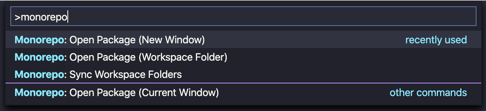

# Monorepo Workspace

Manage monorepos with multi-root workspaces. Supports Lerna, Yarn, Pnpm, Rushjs and recursive package directories.

## Features

All **Monorepo Workspace** functionality can be found in the command palette. Available commands:

Selecting a package:

* `Monorepo: Select Workspace Folders`: select active folders in your workspace, including packages in your repository
* `Monorepo: Open Package (Current Window)`: open a package from your repository in the current window
* `Monorepo: Open Package (New Window)`: open a package from your repository in a new window
* `Monorepo: Open Package (Workspace Folder)`: add a package from your repository as a workspace folder

You can also create workspace folders for all your repository packages with `Monorepo: Sync Workspace Folders`:

## Extension Settings

**Monorepo Manager** tries to detect the type of package based on configurable regexes.

The workspace folder prefix containing the emoji is also configurable.

You can find all options under "Monorepo Workspace" in your configurtion.

## Release Notes

### 1.0.0

Initial release :tada:
