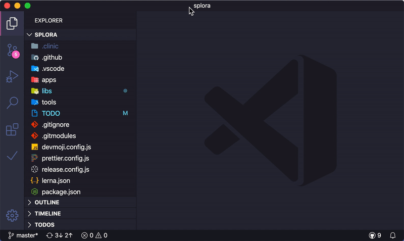
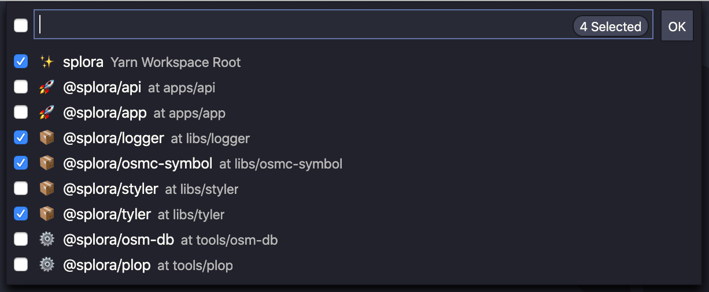
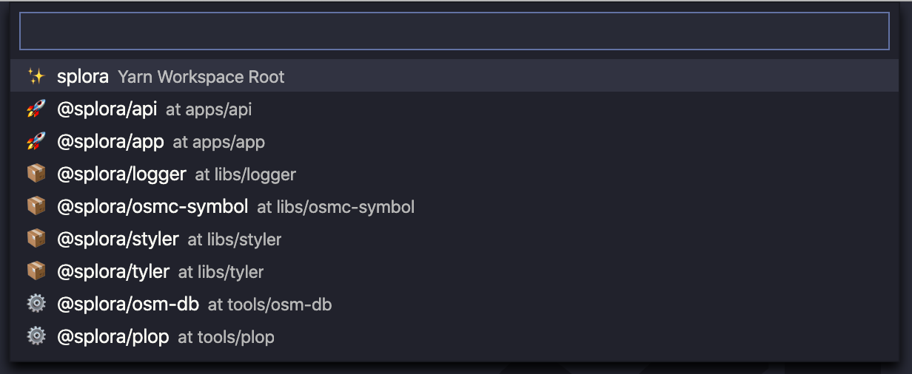
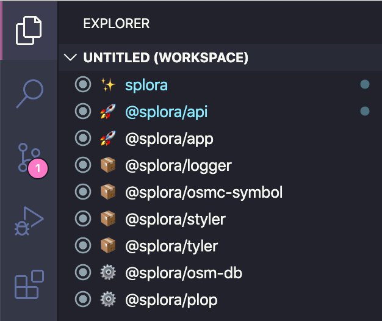

# Monorepo Workspace

Manage monorepos with multi-root workspaces. Supports Lerna, Yarn, Pnpm, Rushjs and recursive package directories.

## Features

All **Monorepo Workspace** functionality can be found in the command palette. Available commands:



Selecting workspace folders:


Selecting one package:


* `Monorepo: Select Workspace Folders`: select active folders in your workspace, including packages in your repository
* `Monorepo: Open Package (Current Window)`: open a package from your repository in the current window
* `Monorepo: Open Package (New Window)`: open a package from your repository in a new window
* `Monorepo: Open Package (Workspace Folder)`: add a package from your repository as a workspace folder

You can also create workspace folders for all your repository packages with `Monorepo: Sync Workspace Folders`:


## Extension Settings

**Monorepo Manager** tries to detect the type of package (library, application or tool) based on configurable regexes.

The workspace folder prefix containing the emoji is also configurable.

You can also configure custom types with a prefix in your JSON settings:

```json
{
  "monorepoWorkspace.folders.custom": [
    {"regex":"app1", "prefix": "🔥"},
    {"regex":"app2", "prefix": "📚"}
  ]
}
```

You can find all options under "Monorepo Workspace" in your configurtion.

## Release Notes

### 1.2.0

Added option to configure custom package types

### 1.1.3

Fixed an issue with workspace folders on Windows

### 1.0.0

Initial release :tada:
